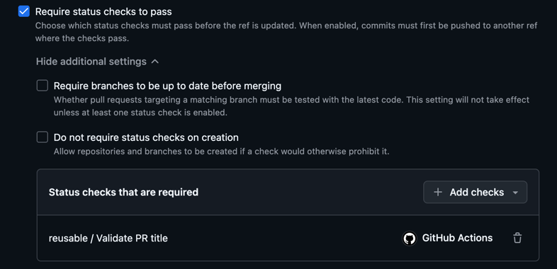
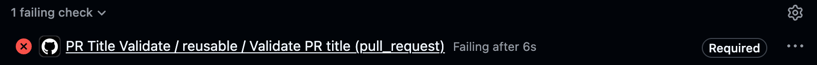

# Changelogs

This repository contains guidelines, templates, configurations, etc for MDAI that will help us format everything properly so that our changelog generator will function as expected. In addition to that, this repository will also contain the changelog that outlines changes across different MDAI components that makes up an release.

### Table of Contents
- [Guidelines](#guidelines)
  - [Pull Request Format](#pull-request-format)
    - [Pull Request Title](#pull-request-title)
      - [Type](#type)
      - [[Optional] Scope](#optional-scope)
      - [Breaking Changes Indicator](#breaking-changes-indicator)
      - [Subject](#subject)
      - [Example](#examples)
    - [Pull Request Description](#pull-request-description)
- [Use Generate Changelog Reusable Workflow](#use-generate-changelog-reusable-workflow)
  - [Inputs](#inputs)
  - [Outputs](#outputs)
  - [Example Usage](#example-usage)
- [Use Semantic PR Title Reusable Workflow](#use-semantic-pr-title-reusable-workflow)
  - [Example Usage](#example-usage-1)

# Guidelines

## Pull Request Format

Changes can only be `Squashed & Merged` to `main` of any repositories of MDAI via a pull request. The pull request must follow the format outlined in this section to both give reviewer an easier time to understand context of the pull request and also to ensure our changelog generator can parse the changes properly.

### Pull Request Title

Title of a pull request must follow the [conventional commit](https://www.conventionalcommits.org/en/v1.0.0/) format (without optional body and footer), meaning the title must following the following structure:

<pre>
<a href="#type">&lt;type&gt;</a></font>(<a href="#optional-scope">&lt;optional scope&gt;</a>): <a href="#subject">&lt;subject&gt;</a>
</pre>

#### Type

Must be one of the following:

- `feat`: Add or change a feature
- `fix`: Fixes issue with the codebase (e.g., bug, business logic error, typo, etc)
  - `security`: A type of fixes that resolve security concerns
  - `style`: A type of fixes address code style (e.g., white-space, formatting, missing semi-colons, etc) and do not affect application behavior
- `doc`: Documentation only changes
- `refactor`: Rewrite or restructure code without altering behavior
  - `perf`: A type of refactor that specifically improves performance
- `test`: Adding missing tests or correcting existing tests
- `revert`: Reverts a previous commit
  - *Note: For revert type, `<subject>` must be the commit message of the commit its reverting (e.g., `revert: fix: fix container/service builder`).*
- `build`: Affect build-related components (e.g., build tools, dependencies, project version, CI/CD pipelines, etc)
- `chore`: Miscellaneous commits (e.g., modifying `.gitignore`)

#### [Optional] Scope

The scope is optional and provides additional contextual information.

> [!IMPORTANT]  
> Do NOT use issue identifiers as scopes.

TODO: Additional instructions will be added once we figure out how we'll be combining changelogs across multiple repositories to form MDAI changelog.

#### Breaking Changes Indicator

A commit that introduce breaking changes must be indicated by an `!` before the `:` in the subject line (e.g. `feat(scope)!: remove deprecated`).

#### Subject

The subject contains a succinct description of the change:
- Use the imperative, present tense: "change" not "changed" nor "changes"
- Do not capitalize the first letter
- Do not end the description with a period (.)
- In case of breaking changes, see [Breaking Changes Indicator](#breaking-changes-indicator)

#### Examples

```
fix: fix container/service builder
```
```
feat(mdai-event-hub): add generic webhook action support
```
```
refactor!: update labels for managed ConfigMaps
```

### Pull Request Description

Make sure you followed the instruction outlined in the `PULL_REQUEST_TEMPLATE.md` of the repository you are working in. 

If the repository you are working in does not have a pull request template yet, please copy [`PULL_REQUEST_TEMPLATE.md`](.github/PULL_REQUEST_TEMPLATE.md) and paste it in the `.github` folder.

> [!TIP]
> `PULL_REQUEST_TEMPLATE.md` find in this repository is only meant to be used as a baseline, it can and should be modified to fit the specific need of each repositories.

## Use Generate Changelog Reusable Workflow

This repository provides a reusable workflow that can be used to generate (using [git-cliff](https://git-cliff.org/)) and commit the changelog in the caller repository.

### Inputs
- `ref`: The branch, tag or SHA used to generate changelog (default: `main`)
- `config-url`: URL of the git cliff configuration file (default: `https://raw.githubusercontent.com/DecisiveAI/changelogs/refs/heads/main/cliff.toml`)
- `dry-run`: True to generate changelog without committing (default: `false`)

### Outputs
- `changelog`: Content of the generated changelog

### Example Usage

#### Basic

This example showcase how to use the workflow with default values:

```yaml
jobs:
  changelog:
    uses: DecisiveAI/changelogs/.github/workflows/reusable-changelog-gen.yaml@main
    secrets: inherit # pass all secrets
```

#### Dry Run

This example showcase how to run the workflow without making any commits:

```yaml
jobs:
  changelog:
    uses: DecisiveAI/changelogs/.github/workflows/reusable-changelog-gen.yaml@main
    with:
      dry-run: true
    secrets: inherit # pass all secrets
```
## Use Semantic PR Title Reusable Workflow

This repository provides a reusable workflow that can be used to lint (using [action-semantic-pull-request](https://github.com/amannn/action-semantic-pull-request)) the PR title according to [conventional commits](https://www.conventionalcommits.org/en/v1.0.0/).

The workflow will comment on the PR if there are any errors and subsequently delete the comment if the check passes.

### Example Usage

#### Adding a new workflow specifically for the `pull_request` event

```yaml
name: PR Title Validate

on:
  pull_request:
    types:
      - opened
      - reopened
      - edited
      - synchronize # as a required action

permissions:
  pull-requests: write

jobs:
  reusable:
    uses: DecisiveAI/changelogs/.github/workflows/reusable-semantic-pr-title.yaml@main
    secrets: inherit # pass all secrets
```

#### Marking the job as required for the repo (one-time setup)
Add a branch ruleset targeting all branches, then check the `Require status checks to pass` checkbox, and select the `reusable/Validate PR title` check.


Then, it will require a passing check before merging like the below screenshot.



### For work-in-progress PRs
Refer to the [WIP](https://github.com/amannn/action-semantic-pull-request?tab=readme-ov-file#work-in-progress-pull-requests) documentation for the action if bypassing the lint is desired.
